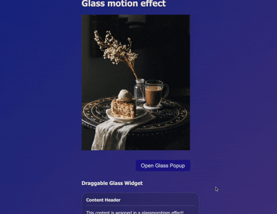

# Angular Glass Motion

[](https://www.npmjs.com/package/angular-glass-motion)
[](https://opensource.org/licenses/MIT)

A modern Angular library that provides a beautiful glassmorphism effect component and a ready-to-use glass popup with optional drag-and-drop functionality. Create stunning UI elements with backdrop blur, transparency, and smooth animations.



## Features

- **Glassmorphism Effect** - Modern glass-like UI with backdrop blur and transparency
- **Draggable Interface** - Optional drag-and-drop functionality
- **Highly Customizable** - Control blur, opacity, colors, and borders
- **Responsive** - Works great on all screen sizes
- **Performance Optimized** - Uses CSS transforms and will-change for smooth animations
- **TypeScript Support** - Fully typed for better development experience
- **Zero Dependencies** - Only requires Angular core packages

## Installation

Install the package via npm:

```bash
npm install angular-glass-motion
```

Or using yarn:

```bash
yarn add angular-glass-motion
```

## Quick Start

### Import the Component

Since this is a standalone component, you can import it directly:

```typescript
import { Component } from '@angular/core';
import { AngularGlassMotionComponent } from 'angular-glass-motion';

@Component({
  selector: 'app-root',
  standalone: true,
  imports: [AngularGlassMotionComponent],
  template: `
    <glass-motion-effect>
      <h2>Hello Glass Motion!</h2>
      <p>Beautiful glassmorphism effect</p>
    </glass-motion-effect>
  `
})
export class AppComponent {}
```

### Basic Usage

```html
<glass-motion-effect>
  <div>
    <h1>Welcome</h1>
    <p>This content has a beautiful glass effect!</p>
  </div>
</glass-motion-effect>
```

## Customization

### Input Properties

| Property | Type | Default | Description |
|----------|------|---------|-------------|
| `blur` | `number` | `10` | Backdrop blur intensity in pixels |
| `opacity` | `number` | `0.1` | Background opacity (0-1) |
| `borderOpacity` | `number` | `0.2` | Border opacity (0-1) |
| `borderRadius` | `string` | `'16px'` | Border radius value |
| `bgColor` | `string` | `'255, 255, 255'` | Background color in RGB format (without 'rgb()') |
| `draggable` | `boolean` | `false` | Enable drag-and-drop functionality |

### Examples

#### Custom Colors and Blur

```html
<glass-motion-effect 
  [blur]="20" 
  [opacity]="0.15"
  bgColor="100, 200, 255">
  <h2>Custom Blue Glass</h2>
</glass-motion-effect>
```

#### Draggable Glass Card

```html
<glass-motion-effect 
  [draggable]="true"
  [blur]="15"
  borderRadius="24px">
  <div class="card-content">
    <h3>Drag me around!</h3>
    <p>This card can be moved anywhere on the screen</p>
  </div>
</glass-motion-effect>
```

#### Dark Glass Effect

```html
<glass-motion-effect 
  bgColor="30, 30, 30"
  [opacity]="0.3"
  [borderOpacity]="0.1"
  [blur]="25">
  <div>
    <h2>Dark Mode Glass</h2>
    <p>Perfect for dark themes</p>
  </div>
</glass-motion-effect>
```

#### High Contrast Glass

```html
<glass-motion-effect 
  [blur]="8"
  [opacity]="0.25"
  [borderOpacity]="0.4"
  borderRadius="12px">
  <div class="info-box">
    <h4>Important Notice</h4>
    <p>Stand out with higher opacity</p>
  </div>
</glass-motion-effect>
```

## Use Cases

- **Hero Sections** - Create eye-catching landing page elements
- **Cards & Panels** - Modern card designs with depth
- **Modals & Overlays** - Beautiful dialog boxes
- **Navigation Menus** - Floating navigation elements
- **Dashboards** - Stylish widget containers
- **Image Overlays** - Text overlays on images with readable backgrounds
- **Draggable Widgets** - Interactive dashboard components

## Component Architecture

The component uses:
- **CSS Custom Properties** for dynamic styling
- **CSS Backdrop Filter** for the glass effect
- **Transform-based positioning** for smooth dragging
- **Event Listeners** managed with Angular's Renderer2
- **Automatic cleanup** of event listeners to prevent memory leaks

## Browser Support

The glassmorphism effect requires modern browsers that support `backdrop-filter`:

- ✅ Chrome 76+
- ✅ Safari 9+
- ✅ Edge 79+
- ✅ Firefox 103+
- ✅ Opera 63+

For older browsers, the component will gracefully degrade with a solid background.

## API Reference

### Component: `AngularGlassMotionComponent`

**Selector:** `glass-motion-effect`

**Inputs:**

```typescript
@Input() blur: number = 10;
@Input() opacity: number = 0.1;
@Input() borderOpacity: number = 0.2;
@Input() borderRadius: string = '16px';
@Input() bgColor: string = '255, 255, 255';
@Input() draggable: boolean = false;
```

**Content Projection:**
Uses `<ng-content>` to project any content inside the glass container.

### Component: `AngularGlassMotionPopupComponent`

**Selector:** `glass-motion-popup`

**Inputs:**

```typescript
@Input() isOpen = false;           // Controls visibility
@Input() closeOnBackdrop = true;   // Close when clicking overlay
@Input() showCloseButton = true;   // Show built-in close button

// Glass Effect Props (Passed through)
@Input() blur = 10;
@Input() opacity = 0.1;
@Input() borderOpacity = 0.2;
@Input() borderRadius = '16px';
@Input() bgColor = '255, 255, 255';
@Input() draggable = false;        // Drag the popup window
```

**Events:**

```typescript
@Output() close = new EventEmitter<void>();
```

**Usage:**

```html
<glass-motion-popup 
  [isOpen]="showModal" 
  (close)="showModal = false"
  [blur]="15"
  bgColor="100, 100, 255">
  <h2>Popup Title</h2>
  <p>Popup content...</p>
</glass-motion-popup>
```

## Advanced Examples

### Responsive Glass Card

```typescript
import { Component } from '@angular/core';
import { AngularGlassMotionComponent } from 'angular-glass-motion';
import { CommonModule } from '@angular/common';

@Component({
  selector: 'app-profile-card',
  standalone: true,
  imports: [CommonModule, AngularGlassMotionComponent],
  template: `
    <glass-motion-effect 
      [blur]="15"
      [opacity]="0.12"
      borderRadius="20px"
      bgColor="200, 220, 255">
      <div class="profile">
        
        <h3>{{ name }}</h3>
        <p>{{ bio }}</p>
        <button>Follow</button>
      </div>
    </glass-motion-effect>
  `,
  styles: [`
    .profile {
      text-align: center;
      padding: 2rem;
    }
    .avatar {
      width: 100px;
      height: 100px;
      border-radius: 50%;
      margin-bottom: 1rem;
    }
  `]
})
export class ProfileCardComponent {
  name = 'John Doe';
  bio = 'Software Developer';
}
```

### Interactive Notification

```typescript
@Component({
  selector: 'app-notification',
  standalone: true,
  imports: [AngularGlassMotionComponent],
  template: `
    <glass-motion-effect 
      [draggable]="true"
      [blur]="12"
      [opacity]="0.15"
      bgColor="50, 205, 50"
      borderRadius="12px">
      <div class="notification">
        <span class="icon">✓</span>
        <div class="content">
          <strong>Success!</strong>
          <p>Your changes have been saved.</p>
        </div>
        <button (click)="close()">×</button>
      </div>
    </glass-motion-effect>
  `,
  styles: [`
    .notification {
      display: flex;
      align-items: center;
      gap: 1rem;
      padding: 1rem 1.5rem;
      min-width: 300px;
    }
  `]
})
export class NotificationComponent {
  close() {
    // Handle close logic
  }
}
```

## Development

### Building the Library

```bash
ng build angular-glass-motion
```

### Running Tests

```bash
ng test angular-glass-motion
```

### Publishing

1. Build the library:
   ```bash
   ng build angular-glass-motion
   ```

2. Navigate to the dist folder:
   ```bash
   cd dist/angular-glass-motion
   ```

3. Publish to npm:
   ```bash
   npm publish
   ```

## Contributing

Contributions are welcome! Please feel free to submit a Pull Request.

1. Fork the repository
2. Create your feature branch (`git checkout -b feature/AmazingFeature`)
3. Commit your changes (`git commit -m 'Add some AmazingFeature'`)
4. Push to the branch (`git push origin feature/AmazingFeature`)
5. Open a Pull Request

## License

This project is licensed under the MIT License - see the [LICENSE](LICENSE) file for details.

## Acknowledgments

- Inspired by modern glassmorphism design trends
- Built with Angular's powerful component architecture
- Thanks to the Angular community for their excellent documentation

## Support

If you encounter any issues or have questions:
- Open an issue on [GitHub Issues](https://github.com/ShubSpyder/shubs-angular-libraries/issues)
- For general questions, use [GitHub Discussions](https://github.com/ShubSpyder/shubs-angular-libraries/discussions)

## Links

- [GitHub Repository](https://github.com/ShubSpyder/shubs-angular-libraries/tree/main/projects/angular-glass-motion)
- [npm Package](https://www.npmjs.com/package/angular-glass-motion)

Please give a star to the repository if you liked the library and share it with your friends 😊.

---

Made by [Shubh]
